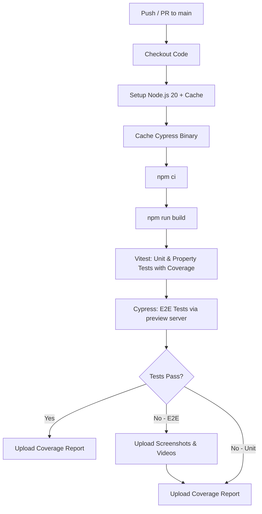
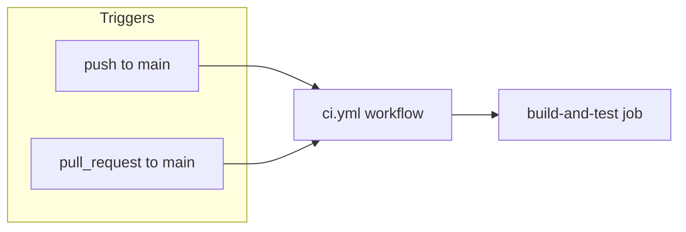

# Design Document: GitHub Actions CI Pipeline

## Overview

This design defines a GitHub Actions CI workflow for the RoadDoggs project that provides automated build verification, unit/property test execution, and end-to-end test execution on every push and pull request to `main`. The pipeline is defined as a single workflow file at `.github/workflows/ci.yml` using a single-job architecture that runs all steps sequentially to share the workspace (build output, installed dependencies) without needing artifact passing between jobs.

### Design Decisions

1. **Single job vs. multi-job**: A single job is chosen because the E2E tests depend on the production build output and installed node_modules. Keeping everything in one job avoids the overhead of uploading/downloading artifacts between jobs and keeps the workflow simple.

2. **`cypress-io/github-action@v6`**: This official action handles starting the preview server, waiting for it to respond, and running Cypress in headless mode — all in one step. It eliminates the need for manual background process management.

3. **Caching strategy**: Both npm cache and Cypress binary are cached with keys derived from `package-lock.json` hash. This ensures caches invalidate exactly when dependencies change.

4. **Conditional artifact uploads**: Failure artifacts (screenshots/videos) use `if: failure()` to only upload on E2E failures. Coverage artifacts use `if: always()` to capture partial results even on test failure.

## Architecture



### Workflow Trigger Flow



## Components and Interfaces

### Workflow File: `.github/workflows/ci.yml`

The workflow is the single deliverable. It contains:

| Component          | Purpose                               | Action/Tool                          |
| ------------------ | ------------------------------------- | ------------------------------------ |
| Trigger config     | Defines when the pipeline runs        | `on: push/pull_request`              |
| Environment setup  | Node.js version and OS                | `actions/setup-node@v4`              |
| npm cache          | Caches `~/.npm` between runs          | `actions/setup-node@v4` cache option |
| Cypress cache      | Caches `~/.cache/Cypress`             | `actions/cache@v4`                   |
| Dependency install | Clean reproducible install            | `npm ci`                             |
| Build step         | Produces production bundle in `dist/` | `npm run build`                      |
| Unit tests         | Runs Vitest with coverage             | `npm run test -- --coverage`         |
| E2E tests          | Runs Cypress against preview server   | `cypress-io/github-action@v6`        |
| Failure artifacts  | Screenshots and videos on E2E failure | `actions/upload-artifact@v4`         |
| Coverage artifacts | Coverage report on every run          | `actions/upload-artifact@v4`         |

### Step Dependencies

```
checkout → setup-node → cache-cypress → npm-ci → build → vitest → cypress → artifacts
```

Each step depends on the prior step completing successfully (except artifact uploads which use conditional execution).

### Key Action Versions

| Action                     | Version | Purpose                     |
| -------------------------- | ------- | --------------------------- |
| `actions/checkout`         | v4      | Clone repository            |
| `actions/setup-node`       | v4      | Install Node.js + npm cache |
| `actions/cache`            | v4      | Cache Cypress binary        |
| `actions/upload-artifact`  | v4      | Upload test artifacts       |
| `cypress-io/github-action` | v6      | Run Cypress E2E tests       |

### Interface: `cypress-io/github-action@v6` Configuration

```yaml
with:
  install: false # Skip install — already done by npm ci
  start: npm run preview # Start Vite preview server
  wait-on: "http://localhost:4173"
  wait-on-timeout: 60 # Max 60s wait for server
  browser: electron # Default headless browser
```

### Interface: Vitest Coverage Configuration

The `npm run test` script already includes `--run` for single execution. Coverage will be triggered via CLI flags:

```yaml
run: npm run test -- --coverage --coverage.reporter=lcov --coverage.reporter=text
```

This produces:

- `coverage/` directory with LCOV data (for artifact upload)
- Text summary printed to stdout (visible in workflow log)

## Data Models

### Workflow YAML Structure

```yaml
name: CI
on:
  push:
    branches: [main]
  pull_request:
    branches: [main]

jobs:
  build-and-test:
    runs-on: ubuntu-latest
    steps:
      # 1. Checkout
      # 2. Setup Node.js 20 with npm cache
      # 3. Cache Cypress binary
      # 4. Install dependencies (npm ci)
      # 5. Build (npm run build)
      # 6. Unit/Property tests with coverage
      # 7. E2E tests (cypress-io/github-action@v6)
      # 8. Upload failure artifacts (if: failure())
      # 9. Upload coverage artifacts (if: always())
```

### Cache Keys

| Cache   | Key Pattern                                                      | Path               |
| ------- | ---------------------------------------------------------------- | ------------------ |
| npm     | Managed by `setup-node` action using `cache: 'npm'`              | `~/.npm`           |
| Cypress | `cypress-${{ runner.os }}-${{ hashFiles('package-lock.json') }}` | `~/.cache/Cypress` |

### Artifact Definitions

| Artifact Name         | Path                  | Retention | Condition       |
| --------------------- | --------------------- | --------- | --------------- |
| `cypress-screenshots` | `cypress/screenshots` | 7 days    | `if: failure()` |
| `cypress-videos`      | `cypress/videos`      | 7 days    | `if: failure()` |
| `coverage-report`     | `coverage/`           | 14 days   | `if: always()`  |

## Error Handling

| Failure Scenario                              | Behavior                                                 | Requirements  |
| --------------------------------------------- | -------------------------------------------------------- | ------------- |
| `npm ci` fails (lockfile missing/out of sync) | Workflow fails immediately, error shown in step log      | 2.3, 2.4      |
| `npm run build` fails                         | Workflow fails, build error shown in step log            | 3.2           |
| Vitest test failure                           | Workflow fails, failing test names/details in step log   | 4.2           |
| Cypress test failure                          | Workflow fails, screenshots/videos uploaded as artifacts | 5.4, 6.1, 6.2 |
| Preview server doesn't start within 60s       | Cypress action times out, workflow fails                 | 5.3           |
| Cache miss                                    | Fresh install runs, workflow continues normally          | 9.4           |
| Partial coverage on test failure              | Coverage artifact still uploaded via `if: always()`      | 8.5           |

### Conditional Execution Logic

- **`if: failure()`** — Used on screenshot/video upload steps. These only execute when the E2E step fails.
- **`if: always()`** — Used on coverage upload. Ensures partial coverage data is captured even when tests fail.
- **`if: success()`** (default) — All other steps use the default behavior of only running when prior steps succeed.

## Testing Strategy

### Why Property-Based Testing Does Not Apply

This feature is a **CI/CD pipeline configuration** (Infrastructure as Code). The deliverable is a declarative YAML workflow file — not a function with inputs and outputs. There is no pure logic that varies meaningfully with input, and no universal properties can be expressed in the form "for all inputs X, property P(X) holds."

**Appropriate testing strategies for this feature:**

1. **Manual validation** — Push the workflow file and verify it triggers correctly on push/PR events
2. **YAML linting** — Use `actionlint` or similar tools to validate workflow syntax
3. **Incremental verification** — Test each step by observing GitHub Actions run output
4. **Smoke testing** — Confirm the workflow runs green on the current codebase

### Verification Approach

| What to Verify                          | How                                           |
| --------------------------------------- | --------------------------------------------- |
| Workflow triggers on push to main       | Push a commit, observe Actions tab            |
| Workflow triggers on PR to main         | Open a PR, observe Actions tab                |
| npm ci uses cache on repeat runs        | Check "Post Setup Node.js" step for cache hit |
| Cypress binary is cached                | Check cache action output for hit/miss        |
| Build produces `dist/`                  | Observe build step output                     |
| Vitest runs with coverage               | Check step log for coverage summary table     |
| Cypress runs against port 4173          | Check cypress action log for server start     |
| Failure artifacts upload on E2E failure | Intentionally fail a test, check artifacts    |
| Coverage artifact always uploads        | Check artifacts tab on both pass and fail     |
| Artifact retention is correct           | Check artifact expiry in Actions UI           |

### Requirements Traceability

| Requirement | Design Component                                             |
| ----------- | ------------------------------------------------------------ |
| 1.1, 1.2    | Trigger config: `on: push/pull_request` on `main`            |
| 1.3         | `runs-on: ubuntu-latest`                                     |
| 1.4         | `actions/setup-node@v4` with `node-version: 20`              |
| 2.1         | `npm ci` step                                                |
| 2.2         | Step ordering: npm ci before build and tests                 |
| 2.3, 2.4    | Default step failure behavior — workflow stops               |
| 3.1         | `npm run build` step                                         |
| 3.2         | Default step failure behavior                                |
| 3.3         | Step ordering: build before Cypress                          |
| 4.1         | `npm run test -- --coverage` step                            |
| 4.2         | Default step failure behavior + Vitest output                |
| 4.3         | `--run` flag already in npm script                           |
| 4.4         | Step ordering: after npm ci                                  |
| 5.1         | `cypress-io/github-action@v6`                                |
| 5.2         | `start: npm run preview`, `wait-on: http://localhost:4173`   |
| 5.3         | `wait-on-timeout: 60`                                        |
| 5.4         | Default step failure behavior                                |
| 5.5         | `install: false`                                             |
| 5.6         | `browser: electron` (headless default)                       |
| 6.1, 6.2    | Upload artifact steps with `if: failure()`                   |
| 6.3         | `retention-days: 7`                                          |
| 6.4         | `if: failure()` ensures execution after prior step failure   |
| 7.1         | `--coverage` flag on Vitest step                             |
| 7.2         | `--coverage.reporter=lcov --coverage.reporter=text`          |
| 7.3         | Text reporter outputs to stdout (visible in log)             |
| 7.4         | V8 coverage provider (Vitest default)                        |
| 8.1, 8.2    | Upload artifact step for `coverage/` named `coverage-report` |
| 8.3         | `retention-days: 14`                                         |
| 8.4         | Cypress videos artifact covers this                          |
| 8.5         | `if: always()` on coverage upload step                       |
| 9.1         | `actions/setup-node@v4` with `cache: 'npm'`                  |
| 9.2         | `actions/cache@v4` for `~/.cache/Cypress`                    |
| 9.3         | Cache key uses `hashFiles('package-lock.json')`              |
| 9.4         | Cache miss → fresh `npm ci` runs, workflow continues         |
