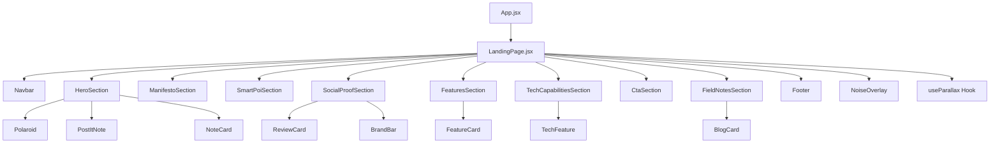
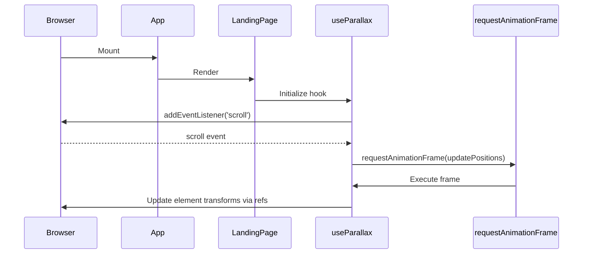
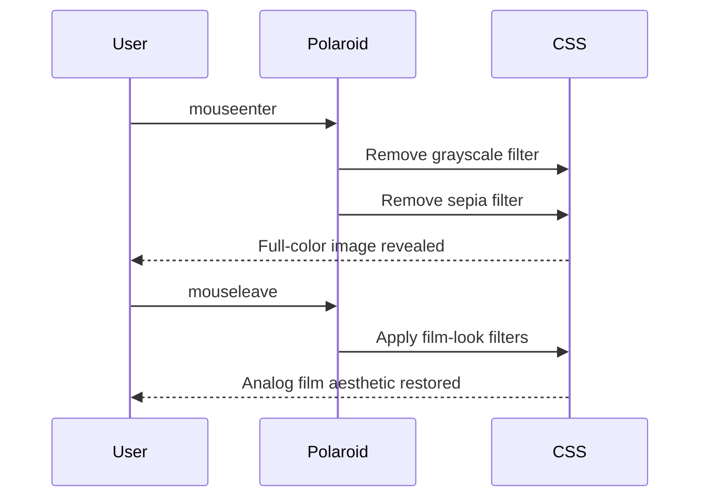
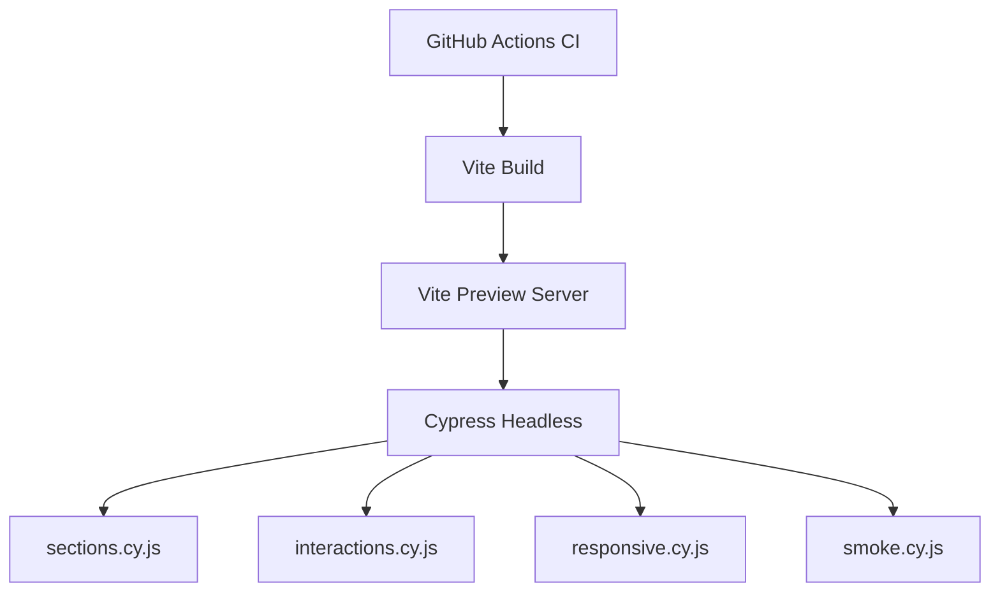
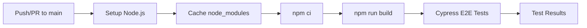

# Design Document: RoadDoggs Landing Page

## Overview

The RoadDoggs landing page is a single-page marketing site with a scrapbook/analog aesthetic that communicates the brand's anti-corporate, adventure-first identity. The page is built as a React.js SPA using component-based architecture with Tailwind CSS v4 for styling, featuring parallax scrolling effects, film-grain image filters, paper/noise texture overlays, and interactive hover states. The design follows the HTML prototype pixel-faithfully, implementing 10 distinct page sections with responsive layouts for mobile and desktop viewports.

The visual language centers on analog metaphors—polaroid photos with tape, thumbtacks, post-it notes, handwritten annotations, receipt-style cards, and scribble arrows—creating a tactile, lo-fi feeling that contrasts with typical polished SaaS landing pages.

## Architecture



## Sequence Diagrams

### Page Load & Parallax Initialization



### User Interaction - Hover Effects



## Components and Interfaces

### Component: App

**Purpose**: Root component that renders the landing page.

```javascript
// src/App.jsx
function App() {
  return <LandingPage />;
}
```

### Component: LandingPage

**Purpose**: Page-level orchestrator that composes all sections and manages the parallax scroll system.

```javascript
// src/pages/LandingPage.jsx
function LandingPage() {
  useParallax(); // Attach scroll listener for parallax elements

  return (
    <div className="text-ink antialiased overflow-x-hidden selection:bg-rust selection:text-white">
      <NoiseOverlay />
      <Navbar />
      <HeroSection />
      <ManifestoSection />
      <SmartPoiSection />
      <SocialProofSection />
      <FeaturesSection />
      <TechCapabilitiesSection />
      <CtaSection />
      <FieldNotesSection />
      <Footer />
    </div>
  );
}
```

### Component: Navbar

**Purpose**: Fixed navigation bar with mix-blend-difference effect for visibility over varied backgrounds.

```javascript
// src/components/Navbar.jsx
function Navbar() {
  // Fixed position, mix-blend-difference, pointer-events-none container
  // Logo: "RoadDoggs" in Fraunces serif + "beta vol.3" handwritten tag
  // CTA: "[ LOG IN ]" button with hover state
}
```

**Responsibilities**:

- Always visible over all page sections via mix-blend-difference
- Logo with handwritten accent tag that rotates on hover
- Login button with color transition hover

### Component: HeroSection

**Purpose**: Full-viewport hero with "GET LOST" headline and parallax photo collage.

```javascript
// src/components/HeroSection.jsx
function HeroSection() {
  // Contains:
  // - Floating background text ("Are we there yet?", "No Signal. Good.")
  // - "/// coordinates_unknown" subheading
  // - "GET LOST" headline with outlined "LOST" text
  // - Scribble arrow SVG with handwritten annotation
  // - Parallax collage of 5 elements (3 polaroids, 1 post-it, 1 note card)
}
```

**Responsibilities**:

- Render headline with text-stroke outline effect
- Position 5 parallax collage items with varying speeds
- Apply film-look filter to images
- Handle grayscale-to-color hover transitions

### Component: Polaroid

**Purpose**: Reusable polaroid-style image card with tape decoration.

```javascript
// src/components/ui/Polaroid.jsx
function Polaroid({ src, caption, rotation, tapePosition, className, speed }) {
  // White border frame
  // Tape decoration (positioned via tapePosition prop)
  // Image with film-look filter
  // Handwritten caption below
  // data-speed attribute for parallax
}
```

### Component: PostItNote

**Purpose**: Yellow sticky note with pin/thumbtack.

```javascript
// src/components/ui/PostItNote.jsx
function PostItNote({ children, rotation, speed }) {
  // Yellow (#fff9c4) background
  // Pin circle decoration at top
  // Handwritten content
  // Parallax data-speed attribute
}
```

### Component: NoteCard

**Purpose**: Sand-colored card with thumbtack decoration.

```javascript
// src/components/ui/NoteCard.jsx
function NoteCard({ children, rotation, speed }) {
  // Sand background
  // Thumbtack circle at top
  // Handwritten quote text
  // Optional CTA button
}
```

### Component: ManifestoSection

**Purpose**: Two-column manifesto explaining the app philosophy.

```javascript
// src/components/ManifestoSection.jsx
function ManifestoSection() {
  // "The Anti-Grid Manifesto." heading with italic rust accent
  // 2-column grid with numbered principles
  // Each principle: numbered label + description text
}
```

### Component: SmartPoiSection

**Purpose**: Dark-themed section with radar visualization showing POI discovery.

```javascript
// src/components/SmartPoiSection.jsx
function SmartPoiSection() {
  // Dark (ink) background with sage grid overlay
  // 2-column layout: text content + radar visual
  // Text: algorithm status indicator, heading, feature descriptions
  // Radar: concentric circles with ping animation, "found" card with connector
}
```

### Component: SocialProofSection

**Purpose**: Reviews section with scrapbook-styled testimonial cards.

```javascript
// src/components/SocialProofSection.jsx
function SocialProofSection() {
  // Header with handwritten accent + "The Co-Pilot Reports." title
  // Star rating stamp (4.9/5)
  // 3-column grid of review cards (receipt, napkin, polaroid styles)
  // Brand logo bar at bottom
}
```

### Component: ReviewCard

**Purpose**: Individual review in one of three visual styles.

```javascript
// src/components/ui/ReviewCard.jsx
function ReviewCard({ variant, quote, author, meta, image, speed }) {
  // variant: 'receipt' | 'napkin' | 'polaroid'
  // Each variant has unique styling:
  //   receipt: white bg, dotted top border, thumbtack hole
  //   napkin: off-white bg, tape, handwritten font
  //   polaroid: white frame, sepia image, handwritten caption
  // Parallax speed and hover rotation reset
}
```

### Component: FeaturesSection

**Purpose**: Two feature cards with offset shadow/border effects.

```javascript
// src/components/FeaturesSection.jsx
function FeaturesSection() {
  // "Tools for Drift." heading with handwritten accent
  // 2-column grid of FeatureCard components
}
```

### Component: FeatureCard

**Purpose**: Feature card with animated shadow border offset.

```javascript
// src/components/ui/FeatureCard.jsx
function FeatureCard({ icon, title, description, tag, shadowColor, children }) {
  // Outer: absolute-positioned shadow/border layer that shifts on hover
  // Inner: main card with icon, tag badge, title, description
  // Children slot for visual mock content
}
```

### Component: TechCapabilitiesSection

**Purpose**: Dark blueprint-style section with 3 technical features.

```javascript
// src/components/TechCapabilitiesSection.jsx
function TechCapabilitiesSection() {
  // Dark (ink) background with white grid lines
  // Header with "Under the Hood" title + hand-drawn arrow
  // 3-column grid of TechFeature items
}
```

### Component: TechFeature

**Purpose**: Individual tech capability with icon and description.

```javascript
// src/components/ui/TechFeature.jsx
function TechFeature({ icon, title, description, iconColor }) {
  // Left border separator
  // Phosphor icon with scale-on-hover
  // Mono title (e.g., "FUEL_LOGIC")
  // Description text
}
```

### Component: CtaSection

**Purpose**: Rust-colored call-to-action with prominent buttons.

```javascript
// src/components/CtaSection.jsx
function CtaSection() {
  // Rust background with noise overlay and decorative SVG path
  // Beta badge pill
  // "Don't just drive. Roam." headline
  // Descriptive text
  // Primary button with shadow offset effect + secondary text link
}
```

### Component: FieldNotesSection

**Purpose**: Blog/field notes in masonry layout with scrapbook card styles.

```javascript
// src/components/FieldNotesSection.jsx
function FieldNotesSection() {
  // "Field Notes" heading with handwritten accent
  // CSS columns-based masonry layout (1 col mobile, 3 col desktop)
  // Mixed card types: image posts, quote cards, guide lists
}
```

### Component: BlogCard

**Purpose**: Individual blog/note card with tape decoration.

```javascript
// src/components/ui/BlogCard.jsx
function BlogCard({ variant, title, image, date, excerpt, items }) {
  // variant: 'image' | 'quote' | 'guide'
  //   image: photo + title + date + excerpt
  //   quote: rust background, large quote text, location
  //   guide: sage tinted, tag badge, bullet list
  // Tape decoration, rotation, hover-to-level transition
}
```

### Component: Footer

**Purpose**: Dark footer with large "GO." text, download CTA, and navigation links.

```javascript
// src/components/Footer.jsx
function Footer() {
  // Dark (ink) background with rust top border
  // 2-column layout:
  //   Left: Giant "GO." text, tagline, download button, handwritten note
  //   Right: Nav links grid, social icons, copyright
}
```

### Component: NoiseOverlay

**Purpose**: Fixed full-screen noise texture overlay for analog feel.

```javascript
// src/components/ui/NoiseOverlay.jsx
function NoiseOverlay() {
  // Fixed position, full viewport
  // Noise SVG background at 8% opacity
  // pointer-events: none, z-index: 9999
}
```

### Hook: useParallax

**Purpose**: Custom hook managing scroll-driven parallax transforms via requestAnimationFrame.

```javascript
// src/hooks/useParallax.js
function useParallax() {
  // On mount: attach scroll event listener
  // On scroll: use requestAnimationFrame for throttled updates
  // Query all elements with [data-speed] attribute
  // Calculate translateY based on scrollY * speed
  // Add subtle rotation: scrollY * 0.01 * speed * 10
  // Use translate3d for GPU acceleration
  // Only animate elements within viewport (with 100px buffer)
  // Cleanup: remove listener on unmount
}
```

## Data Models

### Design System Configuration (Tailwind v4)

```javascript
// tailwind.config.js (or CSS @theme in v4)
const designTokens = {
  colors: {
    paper: "#EAE7DC",
    ink: "#232323",
    rust: "#C8553D",
    sage: "#8E9C6D",
    sand: "#D8C3A5",
    tape: "rgba(255, 255, 235, 0.6)",
  },
  fontFamily: {
    serif: ["Fraunces", "serif"],
    mono: ["Space Mono", "monospace"],
    hand: ["Reenie Beanie", "cursive"],
  },
  animation: {
    drift: "drift 15s ease-in-out infinite",
  },
  keyframes: {
    drift: {
      "0%, 100%": { transform: "translateY(0) rotate(0deg)" },
      "50%": { transform: "translateY(-15px) rotate(1deg)" },
    },
  },
};
```

### Static Content Data

```javascript
// src/data/landingContent.js

export const manifestoItems = [
  { number: '01', title: 'MOST APPS ARE ROBOTS.', description: '...' },
  { number: '02', title: 'THE PACK IS REAL.', description: '...' },
];

export const reviews = [
  { variant: 'receipt', id: '#0492', user: 'SARAH_J', quote: '...', route: 'Route 66' },
  { variant: 'napkin', author: '@Nomad_Mike', quote: '...' },
  { variant: 'polaroid', image: '...', caption: 'Best co-pilot ever. <3' },
];

export const techFeatures = [
  { icon: 'GasPump', title: 'FUEL_LOGIC', description: '...', color: 'rust' },
  { icon: 'CloudWarning', title: 'STORM_AVOID', description: '...', color: 'sage' },
  { icon: 'Satellite', title: 'ANALOG_CACHE', description: '...', color: 'sand' },
];

export const blogPosts = [
  { variant: 'image', title: 'The Van Life Lie?', image: '...', date: 'Oct 12', readTime: '4 min' },
  { variant: 'quote', quote: '...', location: '[Redacted]' },
  { variant: 'image', title: 'Dog Friendly Route 66', image: '...' },
  { variant: 'guide', title: 'Packing for 2 Weeks Off-Grid', items: ['Solar charger', ...] },
];

export const brands = ['OUTSIDE', 'VanLife Mag', 'The Drifter', 'HUCKBERRY'];
```

### Parallax Element Configuration

```javascript
// Speed values per parallax element (from prototype)
const parallaxSpeeds = {
  heroCenterImage: 0.02, // Very slow - anchor element
  heroLeftImage: 0.06, // Slow drift
  heroDogPolaroid: 0.09, // Medium drift
  heroPostIt: 0.04, // Slow drift
  heroNoteCard: 0.08, // Medium drift
  reviewReceipt: 0.03, // Slow
  reviewNapkin: -0.04, // Reverse medium
  reviewPolaroid: 0.06, // Fast
  ratingStamp: -0.02, // Slow reverse
  featureMock: 0.04, // Slow
  featureScribble: -0.03, // Reverse slow
  backgroundScribble: 0.05, // Slow background
};
```

## Error Handling

### Image Loading Failures

**Condition**: Unsplash image URL fails to load
**Response**: Display placeholder with matching aspect ratio and paper-colored background
**Recovery**: Retry not needed for static marketing content; graceful degradation sufficient

### Font Loading Delay

**Condition**: Google Fonts take time to load (FOUT)
**Response**: Use `font-display: swap` in Google Fonts URL to show system font fallback immediately
**Recovery**: Fonts replace fallbacks once loaded without layout shift (similar weight fallbacks chosen)

### Parallax Performance

**Condition**: Low-end device cannot maintain 60fps during parallax
**Response**: Use `will-change: transform` on parallax elements; only animate elements within viewport + 100px buffer
**Recovery**: CSS transitions are hardware-accelerated via `translate3d`; if IntersectionObserver is available, use it to skip off-screen elements

## Testing Architecture

### Cypress E2E Setup



### Test File Structure

```
cypress/
├── e2e/
│   ├── sections.cy.js        # Section rendering & ordering tests
│   ├── interactions.cy.js    # Parallax & hover interaction tests
│   ├── responsive.cy.js      # Viewport/responsive layout tests
│   └── smoke.cy.js           # Page load & console error tests
├── support/
│   ├── commands.js           # Custom Cypress commands
│   └── e2e.js                # E2E support configuration
└── fixtures/                  # Test data fixtures (if needed)
cypress.config.js              # Cypress configuration (baseUrl: http://localhost:4173)
```

### Cypress Configuration

```javascript
// cypress.config.js
import { defineConfig } from "cypress";

export default defineConfig({
  e2e: {
    baseUrl: "http://localhost:4173", // Vite preview server
    viewportWidth: 1280,
    viewportHeight: 720,
    setupNodeEvents(on, config) {},
  },
});
```

### Key Test Scenarios

| Test File          | Scenario                   | What It Verifies             |
| ------------------ | -------------------------- | ---------------------------- |
| sections.cy.js     | All 10 sections present    | DOM structure and ordering   |
| sections.cy.js     | Navbar fixed & visible     | Position and z-index         |
| sections.cy.js     | Hero headline content      | Text rendering               |
| interactions.cy.js | data-speed elements exist  | Parallax system wiring       |
| interactions.cy.js | Scroll triggers transforms | Parallax animation           |
| interactions.cy.js | Hover changes filter       | Film-look image interactions |
| interactions.cy.js | Hover resets rotation      | Review card interactions     |
| interactions.cy.js | Hover changes shadow       | Feature card interactions    |
| responsive.cy.js   | Mobile: single column      | Grid layout at 375px         |
| responsive.cy.js   | Desktop: multi-column      | Grid layout at 1280px        |
| responsive.cy.js   | No horizontal overflow     | Mobile overflow prevention   |
| smoke.cy.js        | No console errors          | Runtime stability            |
| smoke.cy.js        | Images have valid src      | Asset integrity              |
| smoke.cy.js        | Noise overlay present      | Visual layer correctness     |

### CI/CD Pipeline Design



**GitHub Actions Workflow** (`.github/workflows/ci.yml`):

- Triggers on push to `main` and pull requests targeting `main`
- Uses `ubuntu-latest` runner
- Sets up Node.js with dependency caching
- Installs dependencies with `npm ci`
- Builds the project with `npm run build`
- Uses `cypress-io/github-action@v6` to start Vite preview and run Cypress headless
- Fails the pipeline on any test failure

## Testing Strategy

### Unit Testing Approach

- Test component rendering: each section component renders without errors
- Test data-driven content: verify correct number of items rendered from static data
- Test conditional class application: verify rotation, color, and hover-state classes
- Test useParallax hook: verify scroll listener attachment and cleanup

### End-to-End Testing Approach (Cypress)

- **Section rendering tests**: Verify all 10 sections are present in the DOM in correct order
- **Parallax interaction tests**: Verify data-speed elements exist and transforms update on scroll
- **Hover interaction tests**: Verify filter transitions, rotation resets, and shadow changes on hover
- **Responsive layout tests**: Verify grid layouts change between mobile (375px) and desktop (1280px)
- **Smoke tests**: Verify page loads without console errors and all assets are valid

### Integration Testing Approach

- Full page render test: all 10 sections appear in correct order
- Responsive breakpoint tests: verify layout changes at md/lg breakpoints
- Parallax interaction test: scroll events trigger transform updates on data-speed elements

## Performance Considerations

- **Parallax Throttling**: requestAnimationFrame ensures max 60fps update rate, preventing janky scroll
- **Viewport Culling**: Only update transforms for elements within viewport ± 100px buffer
- **GPU Acceleration**: All parallax transforms use `translate3d()` to promote elements to compositor layers
- **Image Optimization**: Unsplash URLs use `w=800&q=80` params to limit download size
- **Font Loading**: Preconnect to fonts.googleapis.com and fonts.gstatic.com for faster font delivery
- **CSS-Only Animations**: Hover states and the ping animation use CSS transitions (no JS needed)
- **will-change**: Applied to parallax elements to hint browser about upcoming transforms

## Dependencies

- **React** (^18.x) - UI framework
- **Tailwind CSS v4** - Utility-first CSS framework
- **@phosphor-icons/react** - Icon library (React components)
- **Vite** - Build tool and dev server
- **Google Fonts** (external CDN) - Fraunces, Space Mono, Reenie Beanie
- **Cypress** (dev) - End-to-end testing framework
- **cypress-io/github-action** (CI) - GitHub Actions integration for Cypress

## Correctness Properties

_A property is a characteristic or behavior that should hold true across all valid executions of a system—essentially, a formal statement about what the system should do. Properties serve as the bridge between human-readable specifications and machine-verifiable correctness guarantees._

### Property 1: Parallax Transform Calculation Consistency

For any scroll position (scrollY) and any element with a `data-speed` attribute, the computed translateY value SHALL equal `scrollY * speed` and the rotation SHALL equal `scrollY * 0.01 * speed * 10`, ensuring deterministic visual positioning for all input combinations.

**Validates: Requirements 5.2, 5.3**

### Property 2: Viewport Culling Correctness

For any parallax element with bounding rect (top, bottom) and any window height, the element SHALL be updated if and only if `top < windowHeight + 100 AND bottom > -100`, ensuring off-screen elements are never needlessly animated.

**Validates: Requirements 5.5**

### Property 3: Variant Rendering Correctness

For any ReviewCard with a valid variant ('receipt', 'napkin', or 'polaroid') and any BlogCard with a valid variant ('image', 'quote', or 'guide'), the rendered output SHALL match the styling rules for that variant with no cross-contamination of styles between variants.

**Validates: Requirements 15.4, 15.7**
